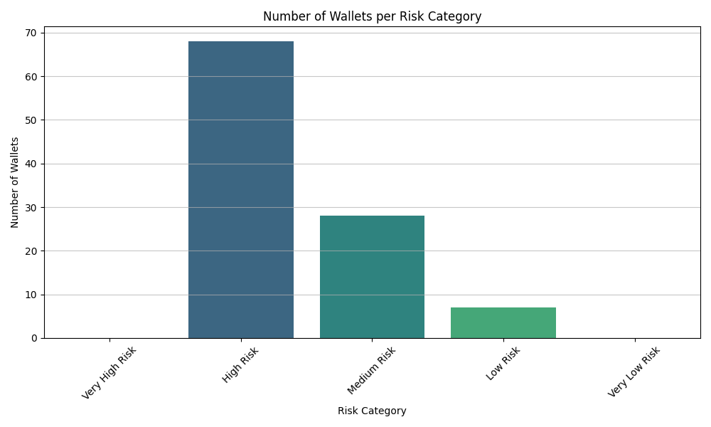
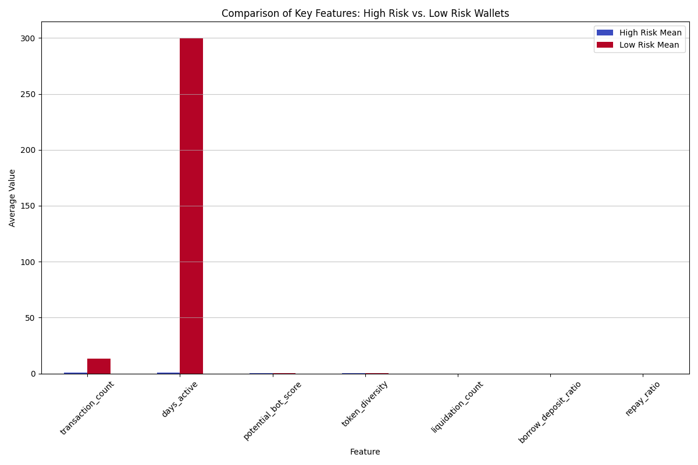
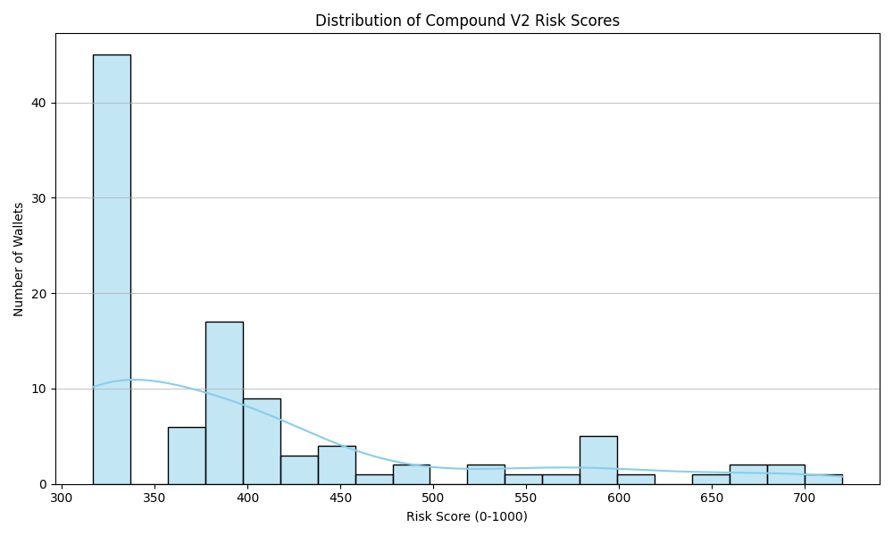

# 🚀 **Directly run on Colab:**  
[Open in Google Colab](https://colab.research.google.com/drive/1ecmSywU1wrYUSU_8t_UM16cN0hM7qWi6?usp=sharing)

# Compound V2 Risk Scoring Pipeline

This repository provides a comprehensive data pipeline to assess the risk profile of Ethereum wallet addresses based on their historical activity with Compound V2 smart contracts. The pipeline collects transaction data, engineers relevant features, and applies a weighted scoring model to identify higher or lower risk wallets in the Compound V2 ecosystem.

---

## Pipeline Overview

The pipeline consists of the following stages:

1. **Data Collection**:  
   Fetches historical transaction data for specified wallet addresses using the Etherscan API. Both token transfers (cTokens, underlying assets) and direct contract calls (e.g., borrow, repay) are collected for all known Compound V2 cToken contract addresses.

2. **Data Enhancement**:  
   Processes raw transaction data into structured pandas DataFrames and derives basic features such as action types, token involvement, and timestamps.

3. **Feature Engineering**:  
   Builds a comprehensive set of features for each wallet, capturing activity levels, financial behavior, risk-relevant contract interactions, and unusual patterns.

4. **Risk Scoring**:  
   Applies a custom, weighted additive scoring model (0-1000 scale) to each wallet, rewarding positive behaviors (activity, diversity, financial maturity) and penalizing negative ones (liquidations, high leverage, inactivity, bot-like patterns).

5. **Analysis & Export**:  
   Summarizes the risk distribution, identifies high/low risk groups, and exports results and visualizations for further assessment.

---

## Data Collection Method

- **Etherscan API** is used for all on-chain data, requiring only wallet addresses and API access.
- **Token Transfers (`action=tokentx`)**: Captures supply and withdrawal actions via cToken or underlying asset movements.
- **Normal Transactions (`action=txlist`)**: Captures direct contract calls (e.g., borrow, repay, liquidation).
- **Rate Limiting** is handled in code to comply with Etherscan's API usage policies.

**Rationale:**  
This method leverages Etherscan's reliability and scalability for blockchain data access, without requiring node infrastructure.

---

## Feature Selection & Rationale

Features are engineered to capture a holistic view of risk in the Compound V2 context:

- **Activity Features**:  
  - `transaction_count`, `unique_actions`, `unique_tokens`, `days_active`, `avg_daily_transactions`, `recent_activity`  
    _Rationale_: High or low activity, broad engagement, and recency are all important for assessing risk and wallet maturity.

- **Financial Features**:  
  - `total_deposits`, `total_withdrawals`, `total_borrows`, `total_repays`, `avg_deposit_size`, `avg_withdrawal_size`, `avg_borrow_size`, `avg_repay_size`, `total_volume`  
    _Rationale_: Provide insight into capital deployment, borrowing/leverage, and asset flow scale.

- **Compound-Specific Risk Features**:  
  - `liquidation_count`, `supply_count`, `withdraw_count`, `repay_ratio`, `borrow_deposit_ratio`, `withdraw_deposit_ratio`, `activity_diversity`, `token_diversity`  
    _Rationale_: Directly tied to lending/borrowing risks, protocol-specific safety, and diversification.

- **Behavioral Patterns**:  
  - `amount_volatility`, `high_value_tx_ratio`, `potential_bot_score`  
    _Rationale_: Identify bots or non-standard usage, which may behave differently in stress scenarios.

- **Risk Indicators**:  
  - `leverage_risk`, `liquidity_risk`, `activity_risk`  
    _Rationale_: Helper features used in scoring for grouping risk factors.

---

## Risk Scoring Method

- **Weighted Additive Model with Penalties:**  
  - Start from a base score (I have used base score of 300).
  - Add points for positive indicators (activity, diversity, financial responsibility, stability).
  - Subtract points for negative indicators (liquidations, high leverage, inactivity, bot-like behavior, poor repayment).
  - Critical risk events (liquidations, excessive leverage) have strong penalties.
  - The final score is clipped between 0-1000, with additional adjustments to enhance score spread at the extremes.

**Justification:**  
This transparent scoring allows every feature's impact to be explicitly defined and tied to established DeFi risk concepts. The 0-1000 scale is clear and interpretable.

---

## Risk Indicator Justification

- **Liquidation History**: Strong signal of poor collateral management.
- **Leverage (Borrow/Deposit Ratio)**: High leverage increases liquidation risk.
- **Insufficient Activity**: Less data, more uncertainty, or dormant wallet.
- **Poor Repayment History**: Rarely repaying borrows is a red flag.
- **Bot-like Behavior**: Automated, repetitive patterns may indicate risk under stress.
- **Suspicious Patterns**: Only borrowing, activity bursts, or long dormancy can signal manipulation.
- **Lack of Diversity**: Single asset/activity focus can be volatile or risky.

---

## Scalability Considerations

- **Modular Design**: Each stage is a separate function for easy testing, parallelization, and future upgrades.
- **API Reliance**: Heavy data query load is offloaded to Etherscan, with built-in rate limiting.
- **Pandas DataFrames**: Fast, memory-efficient tabular operations.
- **Per-wallet Calculations**: Naturally parallelizable if API and infra allow.

---

## Analysis Results

- **Wallets analyzed**: 103  
- **Score range**: 316.7 - 720.0  
- **Mean**: 399.23 | **Median**: 381.67 | **Standard deviation**: 104.56

### Risk Categories

| Category           | Score Range    | Wallets | Percentage |
|--------------------|---------------|---------|------------|
| 🔴 Very High Risk  | 0-200         | 0       | 0.0%       |
| 🟠 High Risk       | 200-400       | 68      | 66.0%      |
| 🟡 Medium Risk     | 400-600       | 28      | 27.2%      |
| 🟢 Low Risk        | 600-800       | 7       | 6.8%       |
| 🔵 Very Low Risk   | 800-1000      | 0       | 0.0%       |

_Most wallets are 'High Risk'; none are at the extremes._

### Risk Level Characteristics

#### 🔴 HIGH RISK WALLETS (≤ 316.7)
- **Count**: 38
- **Avg transactions**: 1.0
- **Avg liquidations**: 0.0
- **Avg borrow/deposit ratio**: 0.00
- **Avg repay ratio**: 0.00
- **Bot-like score**: 0.40

_Low activity and higher bot-score drive risk classification._

#### 🟢 LOW RISK WALLETS (≥ 440.8)
- **Count**: 21
- **Avg transactions**: 13.1
- **Avg liquidations**: 0.0
- **Avg borrow/deposit ratio**: 0.00
- **Avg repay ratio**: 0.00
- **Token diversity**: 0.21

_Low risk is tied to higher activity and more token diversity._

### Score Component Contributions

| Component               | Avg Contribution |
|-------------------------|-----------------|
| activity                | 48.5            |
| financial               | 90.1            |
| diversity               | 29.0            |
| stability               | 45.2            |
| liquidation_penalty     | 0.0             |
| leverage_penalty        | 0.0             |
| bot_penalty             | -42.2           |
| activity_penalty        | -64.6           |
| repayment_penalty       | 0.0             |
| suspicious_penalty      | -6.8            |

_Financial and activity factors are the largest positive contributors. Inactivity and bot-like behavior are the most negative._

---

## Visualizations

### 1. Number of wallets per risk category

### 2. Comparison of key features across risk groups

### 3. Distribution of Compound v2 risk scores

---

